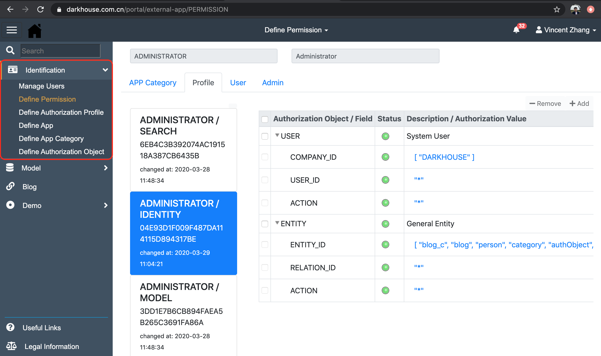
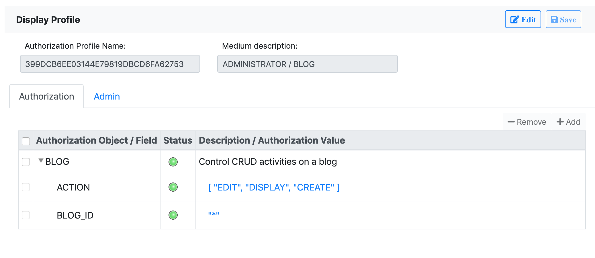
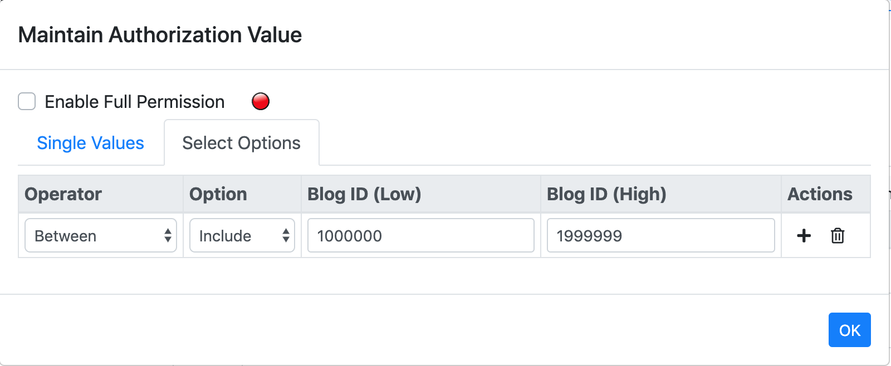

# Authorization
Node-authorization is an object-oriented authorization framework.
It allows end-users rather than developers to define authorizations. 

In real use cases, control which views, APIs, or URI can be accessed or not is far more enough. 
We require different users have different permissions on different business objects.
For example, user A can *edit blogs* in category "DB", while user B can *add blogs* in category 'JS'.
As the categories are growing, it is impossible for developers to change the codes to adapt. 
Instead, you should let the end-users to do the authorization definitions and assignments. 
In other words, You'd better to 

**Split the authorization logic apart from your application logic.** 

## Example
In the project [UI-logon](https://github.com/VinceZK/Logon), you can find a comprehensive realization 
of an identification management solution. You may experience yourself in this [Live DEMO](https://darkhouse.com.cn/logon/).



Following code snippet gives you an simple example on how to embed node-authorization in your project.
```javascript
const Authorization = require('node-authorization').Authorization;
const compileProfile = require('node-authorization').profileCompiler;
const fs = require('fs');

// Read the authorization profile from file system and compile it. 
// You can also store profiles in DB(recommended).
const rawProfiles = [
  JSON.parse(fs.readFileSync('./example/testProfile01', 'utf8')),
  JSON.parse(fs.readFileSync('./example/testProfile02', 'utf8'))
];
const compiledProfile = compileProfile(rawProfiles);

const Authorization = new Authorization('UserID', compiledProfile);
if(!Authorization.check('blog', {Tag:'DB',ID:1000001, Action:'Add'})){
   //Report a message, and break;
}else{
   //Do the add blog;
}
```

## Terminologies
### Authorization Object
*Authorization Object* usually corresponds to a business object, like "user", "blog", "material", "order", and so on.
Sometimes, it can also be an abstract object that is only for the permission check purpose.
For example, if you want to show the total blog reads to certain users,
then you can create an authorization object like "blogStatistic".

### Authorization Field
An authorization object can be assigned with more than one *Authorization Fields*. 
Usually, we have the "Action" authorization field to indicates the operations allowed to a business object.
Besides, we can have attributes derived from the business object as authorization fields. 
This is to facility the permission management by easily group object instances through attributes. 
For example, it is very common to use organizational attributes to group system users,  
such as "company", "department", and "group".

### Authorization 
*Authorization* describes permissions on a business object.
It is an instance of an authorization object with concrete authorization values on each authorization field.
Below example shows an authorization of the "user" authorization object. 
It allows the granted identity has the permission to "Create", "Edit", "Display", "Lock", and "Unlock" 
users that belong to the "Ordinary" group.
```json
{   
    "AuthObject": "user",
    "AuthFieldValue": 
    {
        "Group": ["Ordinary"],
        "Action": ["Create","Edit","Display","Delete","Lock","Unlock"]
    }
}
```

**Note:** authorizations of the same authorization object won't be merged when doing authorization checks. 
Each authorization is an independent permission description which is checked separately during runtime. 

For example, if below authorization is assigned to an identity together with the above authorization. 
It doesn't mean the identity can also do "Edit", "Lock", and "Unlock" on users that belong to the "Admin" user groups. 
```json
{   
    "AuthObject": "user",
    "AuthFieldValue": 
    {
        "Group": ["Admin"],
        "Action": ["Create","Display","Delete"]
    }
}
```

### Authorization Profile
*Authorization Profile* contains multiple authorizations.
It is a logic representation of authorizations that can be assigned to an identity. 
Below authorization profile contains 2 authorizations:

```json
[
    {   "AuthObject": "user",
        "AuthFieldValue":{
            "Group": ["Ordinary"],
            "Action": ["Create","Edit","Display","Delete","Lock","Unlock"]
        }
    },
    {
        "AuthObject": "blog",
        "AuthFieldValue": {
            "Tag": ["DB", "JS", "Algorithm"],
            "ID": [{"Operator":"Between", "Option":"Include", "Low":1000000, "High":1999999}, 2399999],
            "Action": ["Post", "Edit", "Publish"]
        }
    }
]
```

**Note:** the system differentiates "raw profile" and "compiled profile" for the performance reason. 
When the authorization profiles are maintained and stored, they are raw profiles.
When the authorization profiles are read for permission checks, they are converted to a compiled profile. 
This is to achieve better performance by sorting and grouping authorizations.
 
## To Begin

1. Install it:

    ```bash
    $ npm install node-authorization --save
    ```
    
2. Require it and use:
    
   ```javascript  
   var Authorization = require('node-authorization').Authorization;
   var compileProfile = require('node-authorization').profileCompiler;
   
   var Authorization = new Authorization('UserID', compiledProfile);
   if(!Authorization.check('blog', {Tag:'DB',ID:1000001, Action:'Add'})){
       //Report a message, and break;
    }else{
       //Do the add blog;
    }   
   ```
   
3. You can also refer the `test/authorization` and run the tests by:   
   ```bash
   $ npm run test
   ```
## With ExpressJS and PassportJS

It is easy to get confused on authentication and authorization. 
While authentication verifies the user’s identity, 
authorization verifies that the user in question has the correct permissions and rights to access the requested resource.
The two always work together. Authentication occurs first, then authorization. 

[Passport](http://passportjs.org/) is a popular **authentication** middleware which is compatible with [Express](http://expressjs.com/).
And now you can use **Node-Authorization** as an accompaniment with Passport and Express. 
You only need to do following 4 steps:

1. In your Passport login strategy, when the user identification is verified, roll-in its authorization profiles:
    ```javascript
    passport.use(new LocalStrategy(
      function(username, password, done) {
        User.findOne({ username: username }, function (err, user) {
          if (err) { return done(err); }
          if (!user) { return done(null, false); }
          if (!user.verifyPassword(password)) { return done(null, false); }
          
          //Begin profiles roll-in
          //Get user raw profiles, compile them, and save the compiled profile to the session store
          ...
          user.authProfile = compileProfile(rawProfiles);
          //End profiles roll-in
          
          return done(null, user);
        });
      }
    ));
   ```

2. In the passport "serializeUser" function, save the compiled profile to the session storage:
    ```javascript
    /**
     * Cache all the identity information to the session store
     * This method is usually only called once after successfully login
     */
    passport.serializeUser(function(identity, done) {
        done(null, identity);
    });
    ```

3. In the passport "deserializeUser" function, initialize the Authorization object with the session profile:
    ```javascript
    /**
     * Express Session helps to get identity from the session store (like Redis)
     * and pass to this method for *Each* request (should exclude static files).
     * Here, we pass the identity together with Authorization object to req.user.
     * We should not change the identity object as it will reflect to req.session.passport.user,
     * which afterwards will be saved back to Redis session store for every HTTP response.
     */
    passport.deserializeUser(function(identity, done) {
      const user = {
        identity: identity,
        Authorization: null
      };
    
      if(identity.userid && identity.profile)
        user.Authorization = new Authorization(identity.userid, identity.profile);
    
      done(null, user); // be assigned to req.user
    });
    ```

4. In your restful APIs, embed the authorization checks:
    ```javascript
    addBlog:function(req,res) {
        if(!req.user.Authorization.check('blog', {Tag:req.body.blog.tag, ID:req.body.blog.ID, Action:'Add'})){
            res.end('You do not have the permission to add a new blog!');
        }else
            blog.addBlog(req.body.blog, function(msg,blogId){
                ...
                res.json(msg);
            }
         )
    }
    ```

When a user is logged on, the authorization profiles are compiled and saved in the login session storage. 
Then each time the user performs an action on an object, 
corresponding authorization checks can be done before it actually happens. 
Developers can decide where to embed the "authorization.check()" statements.

You can refer the corresponding implementation in project [UI-logon](https://github.com/VinceZK/Logon/blob/master/server/Authentication.js),
as well as its [Live DEMO](https://darkhouse.com.cn/logon/).

## Maintain Authorization Profile
Authorization profiles consists of authorizations. 
They are in JSON format and can be maintained through all possible UI tools by the end-users. 
They are recommended to be saved in DB so that they can be easily associated with login user IDs. 
You can develop a role maintenance UI, which generates the authorization profiles. 
When the roles are assigned to users, the corresponding authorization profiles are also assigned.
Again, you can refer the [Live DEMO](https://darkhouse.com.cn/logon/) and the project [UI-logon](https://github.com/VinceZK/Logon).

A user can be assigned with multiple authorization profiles, 
and each authorization profile includes multiple authorizations. 
Each authorization has one authorization object and more than one authorization fields. 
An authorization field is assigned with authorization values to indicate the granted permissions.

For example, the following profile contains an authorization object named "blog", which has fields "Tag", "ID", and "Action".

```javascript
[
    ...
    {
        "AuthObject": "blog",
        "AuthFieldValue":{
            "Tag": ["DB", "JS", "Algorithm"],
            "ID": [{"Operator":"Between", "Option":"Include", "Low":1000000, "High":1999999}],
            "Action": ["Post", "Edit", "Publish"]
        }
    },
    ...
]
``` 

The permission described by above profile stands for the user who is assigned can do `Post, Edit, and Publish` 
on `blogs` which are tagged with `DB, JS, or Algorithm` and whose ID are `between 1000000 and 1999999`.

The authorization value of a field is usually an array, 
which can contain elementary values(string or integer) or **Select Options**, and they can be mix. 
If you want the full permission, just assign the wildcard "*" to the field.

A select option is described by 4 attributes: "Operator", "Option", "Low", and "High", which are detailed bellow: 

### Operator
Now, following operators are supported:

1. **Between**: between the Low value and High value, the Low and High are both included.

2. **GreaterThan**: greater than the Low value, the High value is ignored. 

3. **LessThan**: less than the Low value, the High value is ignored. 

4. **GreaterEqual**: greater than or equal to the Low value.

5. **LessEqual**: less than or equal to the Low value.

6. **Equal**: equal to the Low value.

7. **NotEqual**: not equal to the Low value.

8. **StartsWith**: the check value is string, and starts with the Low value.

9. **EndsWith**: the check value is string, and ends with the Low value.

10. **Contains**: the check value is string, and contains the Low value.

11. **Matches**: the Low value is a regular expression.

### Option
It only contains 2 possible value: "Include" or "Exclude". 
And "Exclude" is just the complement set of "Include".

### Low & High
Stands for the lower value and higher value. 
Higher value is currently only used in the "Between" operator.

### Authorization Maintenance UI





## Switch Authorization Trace
It is very useful to know which permissions are missing 
when certain authorization checks fail, or when developers want to know which authorization objects are checked
during a certain operation. 

You can switch the authorization trace on by calling following global function:

```javascript
Authorization.switchTraceOn();
```
or switch off:

```javascript
Authorization.switchTraceOff();
```

The trace result is output to the console:

```bash
Identity is "Vincezk'"
Authorization object: "comment2"
Required permission: {"blogID":3999999,"Content":"hello there","Action":"Post"}

 Authorization object: "comment4"
  Required permission: {"blogID":3999999,"Content":".... Shit","Action":"Post"}
   Granted permission: {"AuthObject":"comment4","AuthFieldValueComposition":[{"blogID":[{"Operator":"GreaterThan","Option":"Exclude","Low":4000000}],"Content":[{"Operator":"EndsWith","Option":"Exclude","Low":"Shit"}],"Action":"*"}]}
```

The trace switch on/off does not require the restart of the node processes. It is a hot switch. 
If you provide a function to allow end-users to switch on/off, then it will be much more convenient.

## License
[The MIT License](http://opensource.org/licenses/MIT)